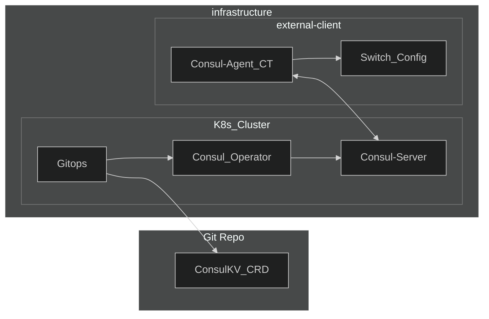

## consul-kv-operator

This is an excuse to learn ansible-operator with [operator-SDK](https://github.com/operator-framework/operator-sdk) by way of attempting to apply GitOps to [consul](https://consul.io) key value pairs. 

The operators inner workings enlist the reuse of the python-consul library and the associated [consul_kv](https://docs.ansible.com/ansible/latest/collections/community/general/consul_kv_module.html) modules to create/update/delete KV's.

Please note the design has forgone security in favor of accessibility and is disigned to be used in conjunction with a consul cluster which is in the same cluster/namespace as the operator.

The only CRD currently avialable is the [ConsulKV](config/samples/consul_v1alpha1_consulkv.yaml):

```
apiVersion: ops.consul.io/v1alpha1
kind: ConsulKV
metadata:
  name: consulkv-sample
  namespace: consul
spec:
  key: configs/sw1
  value: 
    DEVICE_METADATA:
      localhost:
        buffer_model: traditional
        hwsku: Force10-S6000
        mac: 02:42:ac:14:14:03
        hostname: blue_switch
  server: consul-server.consul
```

this is the minimum needed to read/write/delete a KV pair.

### operator sdk

The basis of development has been to use [this tutorial](https://sdk.operatorframework.io/docs/building-operators/ansible/tutorial/) which will help understand the repository layout without rehashing.

### Architecture



The premise is that [CRDs](https://kubernetes.io/docs/tasks/extend-kubernetes/custom-resources/custom-resource-definitions/) for various parts of JSON config are defined externally and represented as KV values inside consul running in a reachable cluster for a given set of infrastructure. A user can create CR's and commit these to a repo which will be pulled into the Consul cluster via GitOps and synced to Consul with the operator.

The design implements:
- a declarative pull based model which is eventually consistent
- a durable and scalable state store (Consul-K8s)
- agent driven reconcilliation which can be supplemented with checks/observabliity

### devcontainer local setup

If you are developing on VSCode the accompanying devcontainer containers all the necessary CLI's/packages to build ansible-operators and run a local development setup.

Review the devcontainer setup or the operator SDK to understand what you need to hack onwards. Note that this is a docker in docker setup which may require further effort if you are running podman or anything other than docker-for-mac and vscode locally.

To build the local cluster you can use [ctlptl](https://github.com/tilt-dev/ctlptl) to spin up  a[kind](https://kind.sigs.k8s.io) cluster with its own registry:
```
ctlptl apply -f kind.yaml
```
to install the dependencies you can use the tiltfile with [tilt](https://tilt.dev):
```
tilt up
```

### Demonstration

Included in the Tiltfile are the necessary tests to manually create CR's in cluster and subsequently ensure they have been configured the external consul-client by way of the agent. The 'apply*' will create the CR, the 'kv*' will use consul-agent to confirm they are in the KV store and the 'cfg*' will confirm they are in the runningconfiguration of the externl client.

You can open [tilt](http://localhost:10350/) and refresh the list of updates in order to apply and modify configs:
- apply_green
- kv_green
- cfg_green
- apply_blue
- kv_blue
- cfg_blue

at any point you can navigate to the [consul_ui](http://localhost:8500) and confirm that the KV which is listed under "configs/sw1" is automatically updating.

If you would like to repeat steps manually see the [Tiltfile](Tiltfile) tests and apply those locally.

```
kubectl delete -f config/samples/consul_v1alpha1_consulkv.yaml
```
the delete will take a moment whilst the finalizer runs but should complete after the KV is removed.

shutdown:
```
tilt down
ctlptl delete -f kind.yaml
```